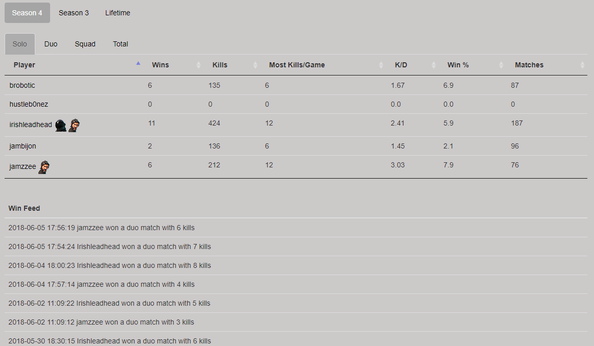

# Overview

*DISCLAIMER*: this project was only uploaded so I could show my work to others. This was also made in Seasons 3 and 4 of Fortnite, so I'm not sure if the API code will work as-is today. If you are interested in running your own version and need help, let me know and I'll do my best to assist. This was also my first Python project of decent size, so the code can be horrendous in some places.

Some friends and I were heavily into Fortnite a while back, and while our stats were available on FortniteTracker, I wanted a way to view all of our stats in one place. I also wanted a cool programming project that involved a variety of technologies such as containers and build systems. Using FortniteTracker's API, I created a simple leaderboard website using Python. Here's an overview of the project and my processes for developing & deploying it.

## Features

* Tracks Fortnite stats(games won, kills per match, etc.) for a group of players. Stats are separated by seasons, as well as lifetime stats.
* As players win games, new wins are announced in the win feed along with the time of the game and how many kills the player had in the game
* In a separate and slightly extended version of this application (not posted on GitHub), I made a simple API for the application. This allows us to query the stats database however we please. The API was created for a simple Discord bot that I made. The bot would announce new wins to the channel as they happened. I chose to run it separately because I wasn't sure how to secure a service that ran an API.

Here is how the stats are presented:

# How it works

1. FortniteTracker retrieves player stats directly from Epic Games' endpoints. Every 3 minutes, their site is updated with the latest stats. Luckily, they are kind enough to provide API access. All you need to do is create an account, log in, and generate an API key.
2. The leaderboard application runs in a Docker container on an AWS EC2 instance (running Ubuntu). AWS Elastic Container Registry handles anything related to the container: configuration, deployment, and image repository.
3. Every 5 minutes, a cronjob on the EC2 instance runs a script (dbupdate.py) inside of the container. This script queries FortniteTracker's API for player stats, and enters them in the local SQLite database

## Development and testing process

1. As changes are made to the code, new code is pushed to the development branch of the project's git repository on my local GitLab server
2. GitLab notifies my local Jenkins server of pushes to the development branch, and kicks off a build job on my local Docker server.
3. This job stops the current running leaderboard container, builds a new container image with the latest code, and launches a container that is based off the new image
3. Since the application runs on port 80 on my Docker host, I simply connect to the hostname of my Docker host in a web browser and make sure everything is working. I should have included some sort of automated testing, but I'm still very much learning and will be soon implementing that in my new Flask project. Once things look good, I move on to deploying to "production"

## Production deployment process

1. Once changes are tested locally, I merge the development branch into the master branch in GitLab
2. GitLab notifies Jenkins of a merge into the master branch, and kicks off another job on the Docker host.
3. This job builds the new production container image, pushes the new image to our image repository on AWS ECR, and tells our application to re-deploy itself with the latest production image. This causes the site to go down for about a minute, but since it only used by myself and a few friends, this was acceptable. More container instances running also means more money spent.

## Container information

The Docker container is based off an Alpine Linux image with Python 3 ready to go. Alpine Linux aims to be small in size but also resource efficient. Since the container will run in AWS, I wanted to keep the container image as small as possible.

A few things happen as the container is spun up:

* The project code is copied in to /app
* A new user is created, so that the application is ran as this user and not root
* LetsEncrypt certificates are copied in to the container. It always felt like a hacky way to achieve HTTPS and I know there's better options, but hey, it worked
* All system packages are updated
* nginx, the web server, is installed
* The nginx configuration is copied in to the container. This allows us serve the site over HTTPS, to reverse proxy the application port to 443, and redirect any port 80 requests to 443
* supervisord is installed
* All python package dependencies are installed from requirements.txt
* Finally, the application is launched using supervisord. supervisord.conf will start the application using gunicorn. gunicorn is great because it will spawn 4 workers and all of them will respond to web requests as they come in

## Postmortem

Ultimately, I was happy with how it turned out and the progress I made in the time spent working on it. It doesn't look great, but I'm not a web designer. I had done two Flask projects with databases before this, but they were far smaller in scope and only took a day or two to complete. I had a very basic version of it up and running in about a week, and iterated on that for the next month. Then I expanded on it by adding an API, which allowed a Discord bot to query data from the application. Once I had the Discord bot announcing new wins in a channel, I felt like I had accomplished what I set out to do and more and ceased work on the project. We also stopped playing Fortnite, so that helped.

There's things I wanted to do better, but I'll tackle those concepts in the next project: better error handling, more efficient and decoupled application structure, and some sort of actual logging solution.

Two highlights for me was: the fact that the leaderboard became part of our Fortnite experience, and the rush of the new season coming out and me having to hurry and implement the new season's stats in the application.

Enter the next project: a Destiny clan stat site. This one is more ambitious in terms of data, so I look forward to sharing that once I consider it complete.
